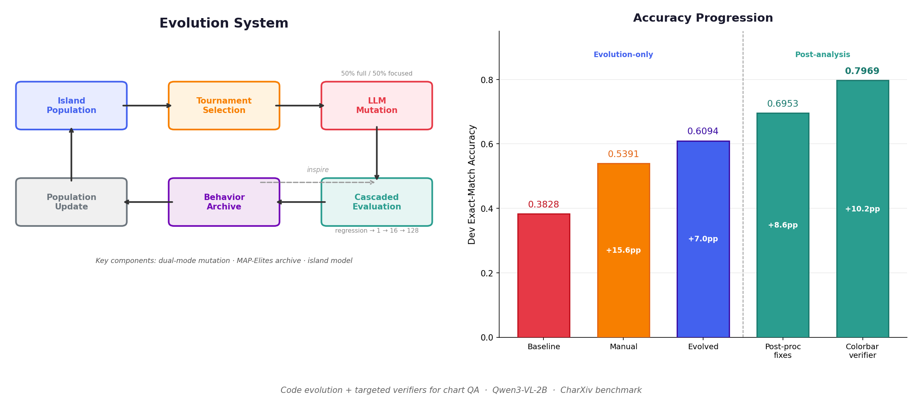

# Evolving VLM Inference for CharXiv

> AlphaEvolve-style optimization of Qwen3-VL-2B for chart question answering.
>
> **Evolution-only:** 38.3 → 60.9 dev exact-match
> **Post-analysis dev-best:** 79.7 dev exact-match
> **Best warm-start latency:** 0.196 ± 0.014 s/query

<p align="center">
  
</p>

<p align="center">
  <a href="./report.pdf">Paper</a> ·
  <a href="#main-results">Results</a> ·
  <a href="#method">Method</a> ·
  <a href="#reproduce">Reproduce</a> ·
  <a href="#limitations">Limitations</a>
</p>

## TL;DR

- This repository optimizes **code**, not just prompts: an AlphaEvolve-style loop mutates and evaluates the Python `vlm_inference` function for chart QA.
- Evolution alone improves the teacher baseline from **0.3828** to **0.6094** on the 128-example CharXiv dev subset.
- Post-processing fixes and targeted verifiers push the best dev result to **0.7969**.
- The key empirical finding is that **narrow binary verifiers** are more reliable than direct uncertain value extraction.
- All headline numbers are on a **development subset**. Held-out performance may differ.

## Main Results

All numbers below use greedy decoding on the 128-example CharXiv descriptive validation subset.

| Variant | Accuracy | Time (s/query) | What changed |
| --- | ---: | ---: | --- |
| `starting_scripts` | 0.3828 | 3.484 | teacher baseline |
| `manual_instruct` | 0.5391 | 0.269 | prompt + normalization |
| `evolved_instruct` | 0.6094 | 0.261 | evolution only |
| `best_accuracy` | **0.7969** | 0.307 | post-processing + targeted verifiers |
| `best_overall` | **0.7813** | 0.305 | best accuracy/speed tradeoff |
| `best_speed` | 0.5781 | **0.196 ± 0.014** | batched warm-start path |

<sub>Warm-start mean±std over 6 back-to-back runs; cold-start: 0.46–0.55 s/query.</sub>

### Two-Layer Headline

To separate generalizable improvement from dev-set tuning, results are reported in two tiers:

| Tier | Range | Interpretation |
| --- | --- | --- |
| Evolution-only | 0.3828 → 0.6094 | cleaner estimate of search-driven gain |
| Post-analysis dev-best | 0.6094 → 0.7969 | stronger dev performance, but with higher overfitting risk |

### 4-Fold Stability Check

Same fixed program evaluated on non-overlapping quarters (not re-derived per fold):

| Variant | Mean ± Std | Per-fold |
| --- | --- | --- |
| `best_accuracy` | 0.797 ± 0.031 | 0.8125, 0.7500, 0.8125, 0.8125 |
| `best_overall` | 0.781 ± 0.026 | 0.7813, 0.7500, 0.8125, 0.7813 |

Grouped-by-figure, stratified-by-question-type CV (`--grouped`) is also supported — see [Reproduce](#reproduce).

## Key Findings

1. **Evolution beats manual tuning.**
   The largest clean gain comes from mutating and selecting inference programs rather than only editing prompts by hand.

2. **Exact-match chart QA is bottlenecked by formatting and hallucination.**
   Post-processing fixes alone recover substantial accuracy.

3. **Verifier design matters more than multi-model routing.**
   A targeted colorbar-existence verifier closes the error mode that originally motivated an Instruct/Thinking router.

4. **Negative results are informative.**
   An Instruct/Thinking router was implemented (`best_accuracy_v3.py`, 0.7500) but underperformed the verifier-augmented single-model path (0.7969). The colorbar verifier already absorbs the Thinking model's NA-detection advantage.

## Method

### Evolution System

```text
Population → Tournament Selection → LLM Mutation → Cascaded Evaluation → Archive → Population
                                        ↑                                    |
                                        └──────── archive inspiration ────────┘
```

- **LLM-guided mutation:** dual-mode edits (full-block rewrites and focused function edits)
- **Cascaded evaluation:** regression tests → crash check → stratified pre-screen → full evaluation
- **Shared model injection:** load the VLM once and inject it into candidate programs
- **Behavioral diversity archive:** archive candidates by behavioral signatures, not only scalar score
- **Island model:** parallel sub-populations with periodic migration

### Targeted Verifiers

- **Title verifier:** panel-marker robustness via simple test-time augmentation
- **Colorbar verifier:** a narrow yes/no probe that is more reliable than direct uncertain visual extraction

### Ablation ([details in report](./report.pdf))

- **Cascaded eval**: 31% of candidates crashed; cascade saved ~35 min of wasted GPU time
- **Diversity archive**: 13 unique behavior descriptors across 20 evaluations
- **Back-port test**: fixes applied to evolved v2 base yield 0.7578 (vs 0.7969 on v1), showing partial base-specificity

## Reproduce

```bash
pip install -r requirements.txt
# Download CharXiv images into charxiv/images/ (see charxiv/images/README.md)

# Full benchmark (all variants + grouped CV + speed loop)
bash reproduce.sh

# Individual evaluations
python evaluate.py best_accuracy                      # single run
python evaluate.py best_accuracy --cv 4               # 4-fold stability (sequential)
python evaluate.py best_accuracy --cv 4 --grouped     # 4-fold grouped-by-figure + stratified

# Re-run evolution (requires OPENAI_API_KEY)
export OPENAI_API_KEY="sk-..."
python evolve_instruct.py
python evolve_thinking.py
```

## Limitations

- All headline numbers are from a **128-example development subset**.
- The **post-analysis dev-best** tier includes manual error analysis and therefore carries overfitting risk.
- The 4-fold check evaluates **fixed programs** across folds; it is not nested cross-validation.
- Grouped-by-figure evaluation is more conservative than naive contiguous folds and should be preferred for reporting stability.

## Repository Guide

| File | Role |
| --- | --- |
| `evolve_instruct.py` | main AlphaEvolve-style search loop |
| `evolved_instruct.py` | best evolution-only program (0.6094) |
| `best_accuracy.py` | strongest dev result (0.7969) |
| `best_accuracy_v3.py` | Instruct/Thinking router — negative result (0.7500) |
| `best_overall.py` | best accuracy/speed balance (0.7813) |
| `best_speed.py` | batched fast path (0.196 s/q warm-start) |
| `evaluate.py` | evaluation and CV driver (`--cv`, `--fold`, `--grouped`) |
| `report.pdf` | paper/report |

<details>
<summary>Full file tree (click to expand)</summary>

```
├── starting_scripts.py         # Teacher baseline
├── manual_instruct.py          # Hand-optimized (Instruct)
├── manual_thinking.py          # Hand-optimized (Thinking)
├── evolve_instruct.py          # Evolution system (Instruct)
├── evolve_thinking.py          # Evolution system (Thinking)
├── evolved_instruct.py         # Best evolved program (Instruct, 0.6094)
├── evolved_thinking.py         # Best evolved program (Thinking, 0.5547)
├── best_accuracy.py            # Highest accuracy (0.7969)
├── best_accuracy_v2.py         # Back-port: evolved v2 + same fixes (0.7578)
├── best_accuracy_v3.py         # Instruct/Thinking router — negative result (0.7500)
├── best_overall.py             # Best accuracy/speed tradeoff (0.7813)
├── best_speed.py               # Fastest inference (0.196 s/q warm-start)
├── ablation_no_archive.py      # Ablation: evolution w/o diversity archive
├── ablation_no_cascade.py      # Ablation: evolution w/o cascaded eval
├── evaluate.py                 # Evaluation harness (--cv, --fold, --grouped)
├── reproduce.sh                # Run all evaluations
├── requirements.txt            # Pinned Python dependencies
├── report.tex / report.pdf     # NeurIPS-format paper
├── LICENSE                     # MIT
├── CITATION.cff                # Citation metadata
├── assets/
│   └── teaser.png              # Teaser figure for README
└── charxiv/                    # CharXiv benchmark data + eval code
    ├── data/                   #   JSON question/answer files
    ├── images/                 #   Chart images (download separately)
    └── src/                    #   Evaluation utilities
```

</details>

## Models

- **Answering**: `Qwen/Qwen3-VL-2B-Instruct` / `Qwen/Qwen3-VL-2B-Thinking` (fixed, bfloat16, greedy)
- **Mutation** (evolution only): `gpt-5.2-codex` via OpenAI API

## License

[MIT](LICENSE)

## Citation

Please use the metadata in [`CITATION.cff`](CITATION.cff), or:

```bibtex
@software{huang2026evolving,
  author  = {Huang, Qi},
  title   = {Evolving {VLM} Inference for {CharXiv}},
  year    = {2026},
  url     = {https://github.com/QiHuang321/Evolving}
}
```

See [report.pdf](./report.pdf) for the full writeup.
